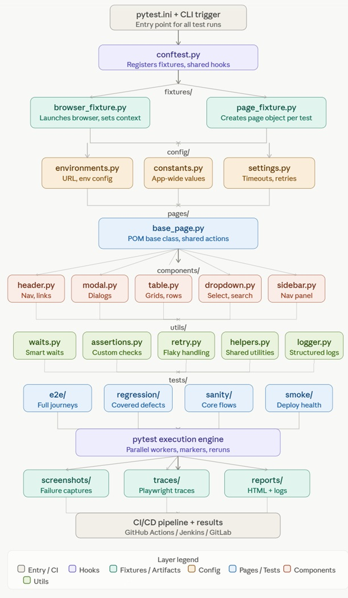

# python-playwright-test-framework

A scalable, reusable, and enterprise-ready UI automation framework built with Python, Playwright, and Pytest, following the Page Object Model (POM) design pattern.

## Core Technologies 

| Purpose                  | Tool             |
|--------------------------|------------------|
| Programming Language     | Python 3.12+     |
| UI Automation            | Playwright       |
| Test Runner              | pytest           |
| HTML Reports             | pytest-html      |
| Parallel Execution       | pytest-xdist     |
| Environment Management   | python-dotenv    |
| Test Data Generation     | Faker            |
| Configuration Management | Pydantic         |
| Application & Test Logs  | Logging          |
| Version Control          | Git              |

## Installation Steps

1. Create the python playwright automation framework in github account and clone in local
2. Create the folder structure for the framework:

### Framework Structure

```
playwright-python-test-framework/
│
├── README.md
├── requirements.txt
├── pyproject.toml
├── pytest.ini
├── .gitignore
├── .env
│
├── config/
│   ├── config.py
│   ├── settings.py
│   └── environments.py
│
├── pages/
│   ├── base_page.py
│   ├── login_page.py
│   ├── dashboard_page.py
│   ├── cart_page.py
│   └── checkout_page.py
│
├── locators/
│   ├── login_locators.py
│   ├── dashboard_locators.py
│   └── cart_locators.py
│
├── tests/
│   ├── smoke/
│   ├── regression/
│   ├── sanity/
│   └── api/
│
├── fixtures/
│   ├── browser_fixture.py
│   ├── data_fixture.py
│   └── user_fixture.py
│
├── utils/
│   ├── logger.py
│   ├── helper.py
│   ├── waits.py
│   ├── screenshot.py
│   └── retry.py
│
├── data/
│   ├── users.json
│   ├── testdata.json
│   └── products.json
│
├── reports/
│
├── screenshots/
│
├── logs/
│
├── traces/
│
└── .github/
    └── workflows/
        └── automation.yml
```

3. Create the virtual environment and activate the virtual environment

```Powershell
py -m venv .venv

.\.venv\Scripts\Activate

Optional: Run below if PowerShell is blocking the activate script from running:
Set-ExecutionPolicy -Scope CurrentUser RemoteSigned

```

4. Install your dependencies from requirements.txt:

```Bash
pip install -r requirements.txt
playwright install
```

### Automation execution flow



**Entry** — `pytest.ini` + CLI command bootstraps the run with markers, workers, and output settings.

**conftest.py** — the central hub that registers all fixtures and hooks before any test touches the browser.

**Fixtures** — `browser_fixture.py` spins up the Playwright browser/context, while `page_fixture.py` creates a fresh page object per test.

**Config** — `environments.py` feeds base URLs, `constants.py` holds shared values, `settings.py` controls timeouts and retry counts — all injected via fixtures.

**Base Page** — `base_page.py` is the POM foundation. Every page-specific class inherits from it, giving uniform `navigate()`, `wait_for_element()`, etc.

**Components** — reusable UI building blocks (`header`, `modal`, `table`, `dropdown`, `sidebar`) are consumed by page objects, keeping selectors DRY.

**Utils** — cross-cutting helpers: `waits.py` for smart dynamic waits, `assertions.py` for custom checks, `retry.py` for flaky-test resilience, `logger.py` for structured output.

**Test suites** — four tiers: `smoke` (post-deploy health), `sanity` (critical paths), `regression` (defect coverage), `e2e` (full user journeys).

**Execution engine** — pytest runs them in parallel workers with marker-based filtering and rerun-on-failure.

**Artifacts** — screenshots on failure, Playwright trace files for debugging, and HTML reports all feed the final CI/CD pipeline result.

